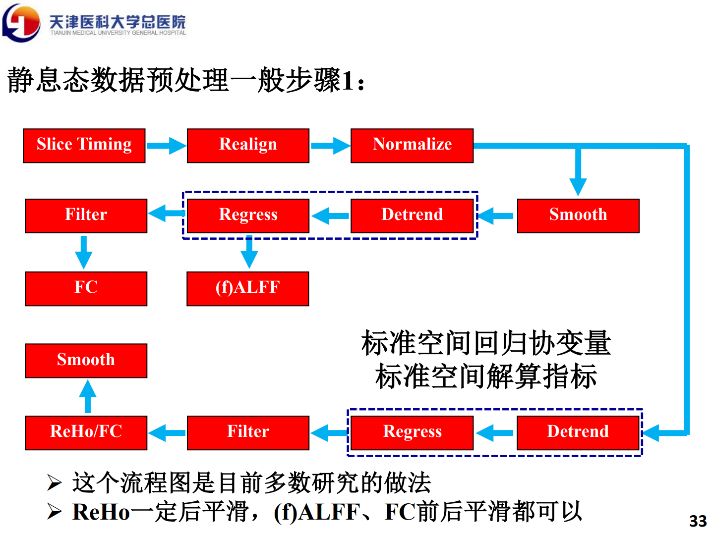
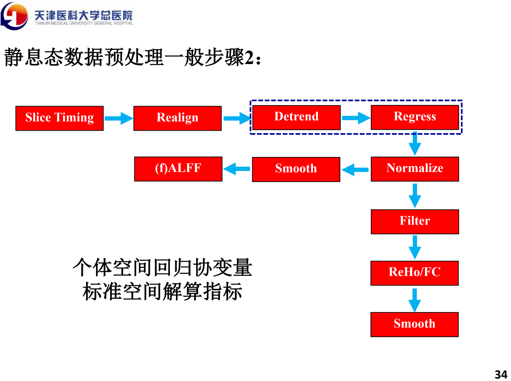
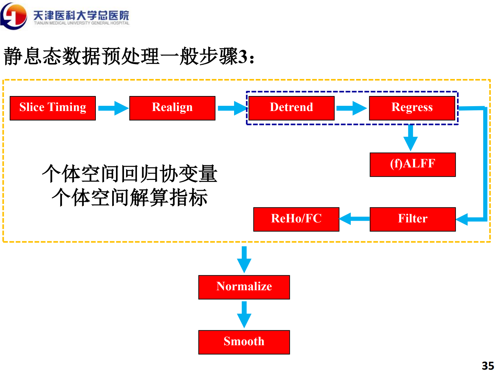
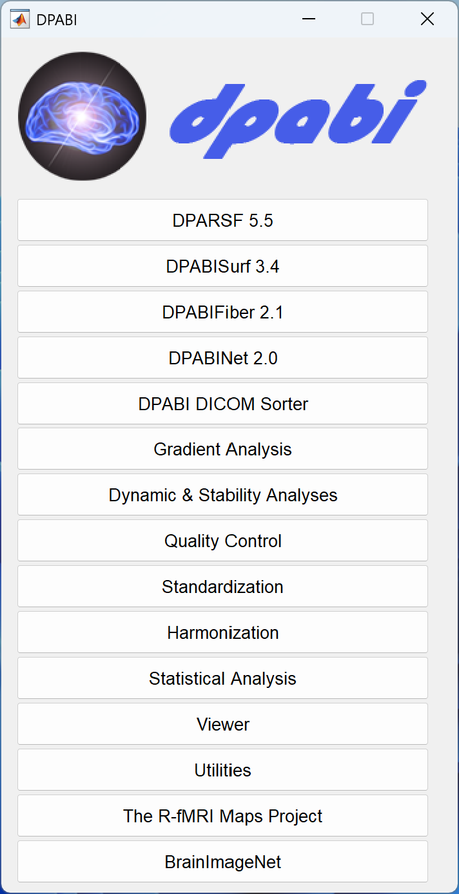
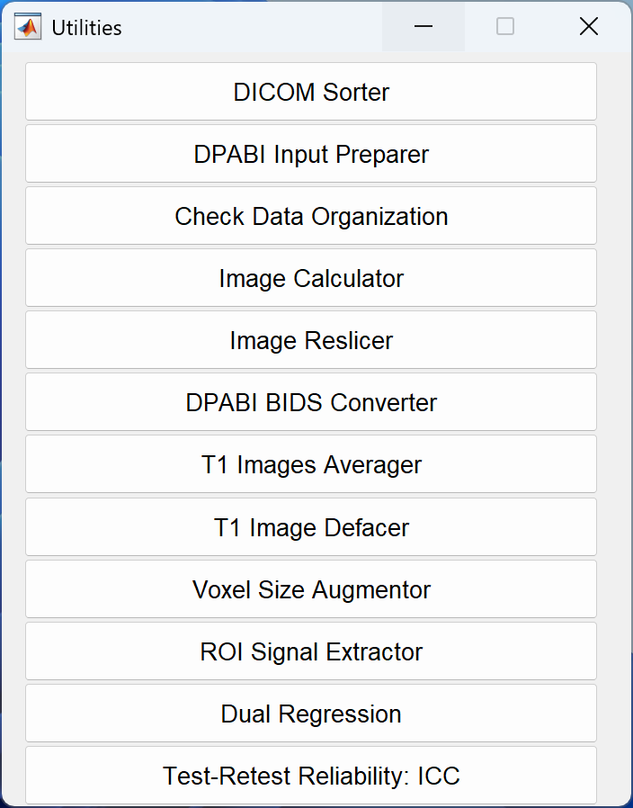
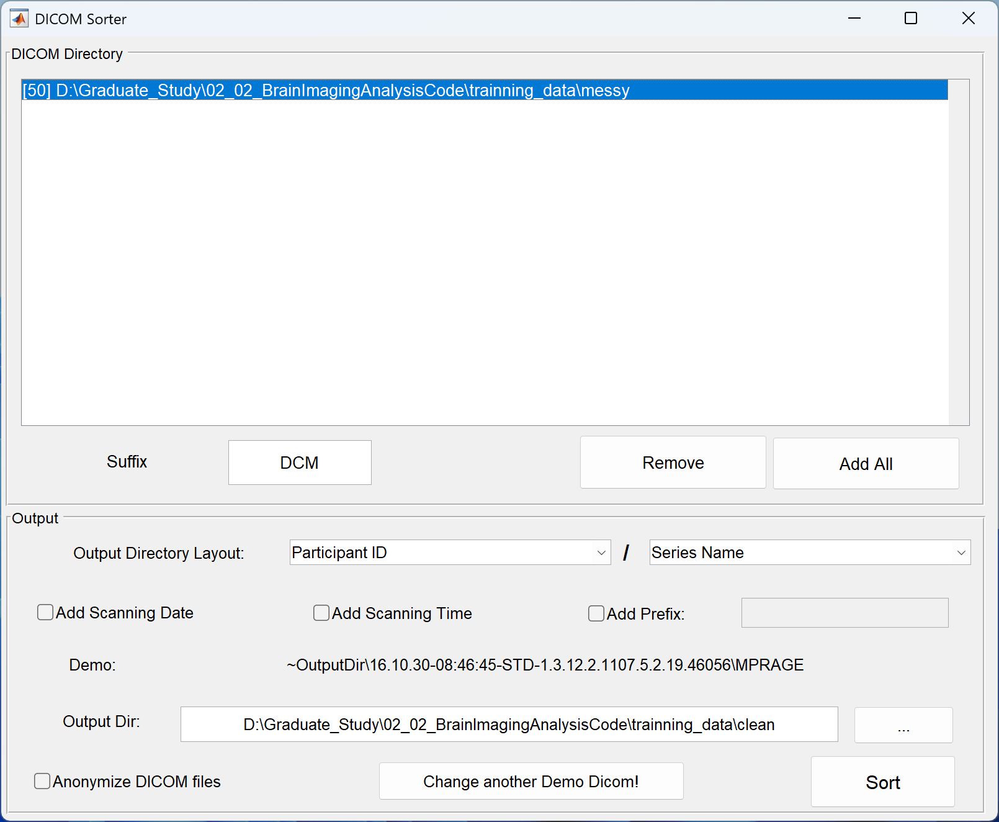
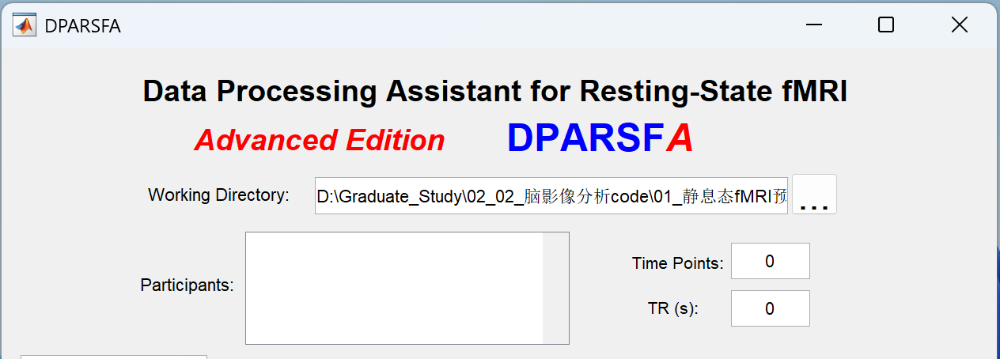

# 静息态fMRI预处理

### 静息态预处理理论

#### 静息态功能磁共振研究流程：

1. 数据预处理
   1. 数据转换（delete）：DICOM$\rightarrow$NIFTI(.nii/.hdr/.img/.nii.gz)
   2. 时间层校正（Slice Timing）：磁共振图像是逐层扫描，这样每一层的获取时间不同。需要做一个时间尺度的校正，保证一个Volume内所有体素获取的时间在理论上是一致的。
   3. 头动校正（Realine）：校正在扫描过程中时间点（volume）之间被试的轻微头动。该步骤并不能完全去掉头动带来的影响（后续regress）。
   4. 空间配准（Normalize）：将不同被试个体空间的数据配准到标准空间，以解决不同被试之间脑形态的差异和扫描时空间位置不一致的问题。配准后理论上所有被试同一体素对应的解剖结构是相同的，从而可以在标准空间进行基于体素的统计比较。
   5. 空间平滑（Smooth）：减少配准误差；增加数据信噪比；增加数据的正态性以便进行统计分析。
   6. 去除线性漂移（Detrend）：由于机器工作而升温以及被试长久扫描产生的疲劳，随着时间的积累会存在一个线性趋势。
   7. 滤波（Filter）：一般认为BOLD信号中低频成分主要反映了脑自发的神经活动，具有生理意义（一般0.01～0.08或0.1HZ）。
   9. 去除协变量（Regress）：减少头动、白质、脑脊液信号的影响（全脑信号？）。
   
     
       
       

2. 指标解算
   1. **局部一致性（ReHo）**：常用的局部定义有面连接（6+1个）、边连接（6+12+1个）、点连接（6+12+8+1个）。用肯德尔和谐系数$W$来衡量局部一致性。基于时间序列计算的ReHo为KCC-REHO；基于频率计算的ReHo为Cohe-REHO。
      $$
      W=\frac{\sum(R_i)^2-n(\bar{R})^2}{\frac{1}{12}K^2(n^3-n)}
      $$
   
      > 注意：在预处理的时候不要进行平滑，计算完ReHo指标后再进行平滑（Smooth）。
   
   2. **低频振幅（ALFF）**：
      $$
      X(f)=FFT(x(t))=A(f)+iB(f)
      $$
   
      $$
      P(f)=|X(f)|^2=A^2(f)=B^2(f)
      $$
   
      $$
      ALFF=\sqrt{\sum P(f)}=\sqrt{\sum^{0.08}_{f=0.01}P(f)}
      $$
   
      其中，FFT为快速傅里叶变换，$P(f)$为功率谱。
   
   3. **比率低频振幅（fALFF）**：低频占整个频率范围的比例。
      $$
      fALFF=\frac{\sum^{0.08}_{f=0.01}|X(f)|}{\sum^{f_{max}}_{f=0}|X(f)|}
      $$
   
      > 注意：预处理不要filter，需要保留全频段。
   
2. 统计分析
   
4. 结果可视化（section、slice、render）
   
5. 成果转化——论文

### 静息态预处理实践

#### 模态分类

操作步骤：dpabi $\rightarrow$ Utilities $\rightarrow$ DICOM Sorter

DICOM Sorter用于DICOM数据的模态分类，例如：3D、DTI、REST

#### 数据的导入

- Working Directory：静息态fMRI数据预处理总目录，存放所有预处理过程文件的总文件夹。
- Participants: 导入需要处理的被试。
- Starting Directory Name：指定从Working Directory中的哪个文件夹（主要是过程文档）开始处理。默认为FunRaw，即初始的DICOM数据集。

> # 数据导入原则
>
> 如果是原始DICOM数据，需要在根目录（Working Directory）下建立FunRaw文件夹，用于存放Sub1, Sub2,…,Subn等被试的DICOM数据。
>
> 如果是nii（或hdr/img或nii.gz）数据，在根目录（Working Directory）下建立FunImg（默认名称，可为其他）文件夹，用于存放Sub1, Sub2,…,Subn等被试的INfTI数据。
>
> 如果是DPARSFA的过程数据（例如：已完成Realign的FunImgAR、完成DCM2INfTI的FunImg)，需要在Starting Directory Name指定该过程数据的文件夹。
>
>  如果使用DPARSFA处理功能像的同时也加入结构像，需要建立T1Raw文件夹。如果是转换后的数据，则需要建立T1Img文件夹 。

> # Tips
>
> Tips 1：先设置MATLAB的工作路径，方便后续操作。
>
> Tips 2：DPARSFA的Working Directory是FunRaw文件夹的父级文件夹。
>
> Tips 3：文件夹命名不能含有中文和空格（路径中也不能含有）。
>
> Tips 4：FunRaw, T1Raw区分大小写。
>
> Tips 5：FunRaw, T1Raw中，同一个被试数据的两个文件夹命名要相同，并且，数据文件夹一一对应，即文件夹数量一致（即通过dpabi $\rightarrow$ Utilities $\rightarrow$ Check Data Organization的数据检查）。

#### 内置模板参数（Template Parameters)

| 选项                                      | 计算步骤                  | 描述                                   |
| ----------------------------------------- | ------------------------- | -------------------------------------- |
| Calculate in MNI Space:TRADITIONAL order  | 静息态数据预处理一般步骤1 | 标准空间回归协变量，标准空间解算指标。 |
| V5:Calculate in MNI Space(warp by DARTEL) | 静息态数据预处理一般步骤2 | 个体空间回归协变量，标准空间解算指标。 |
| Calculate Original Space(warp by DRTEL)   | 静息态数据预处理一般步骤3 | 个体空间回归协变量，个体空间解算指标。 |

#### 文件名称后缀

| 字母 | 描述         | 字母 | 描述              |
| ---- | ------------ | ---- | ----------------- |
| A    | Slice timing | R    | Realign           |
| W    | Normalize    | S    | Smooth            |
| D    | Detrend      | C    | Regress covariate |
| F    | Filter       | B    | Scrub             |

 

